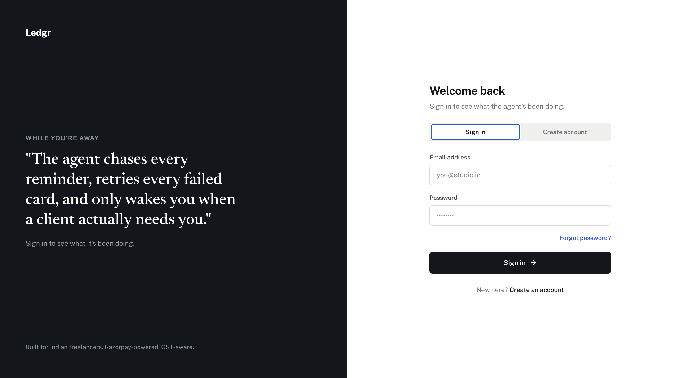
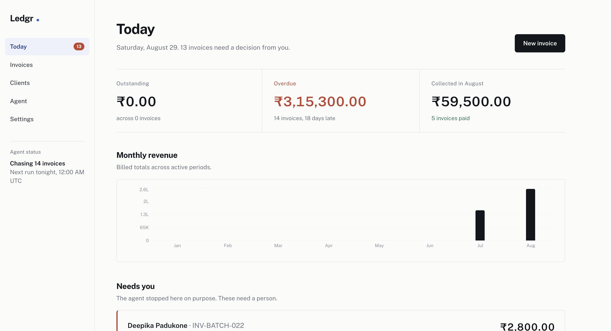
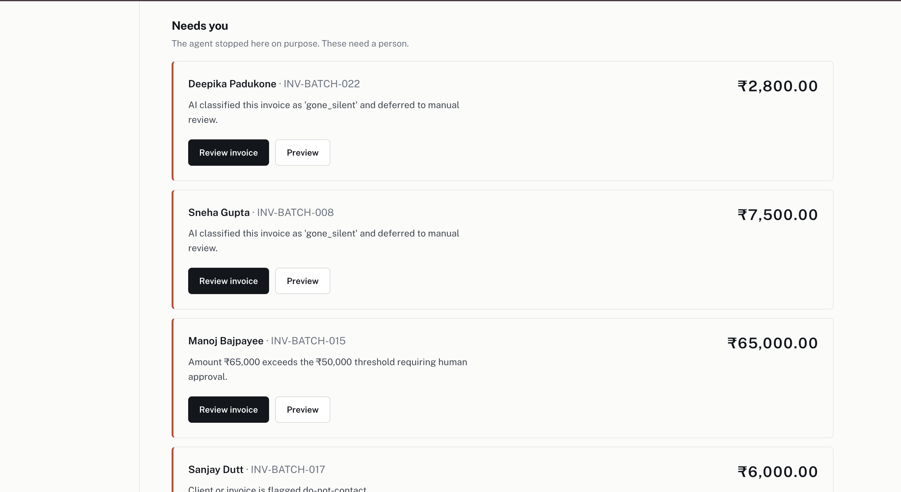
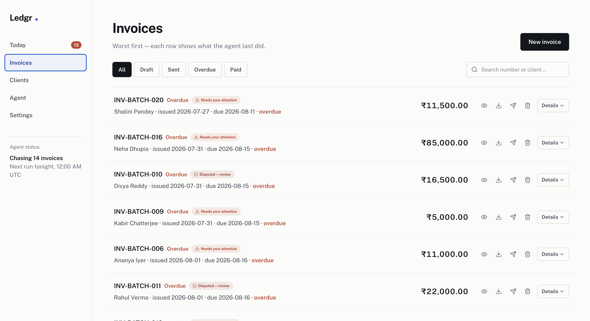
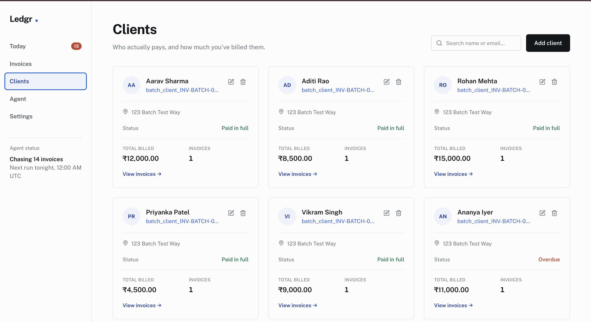
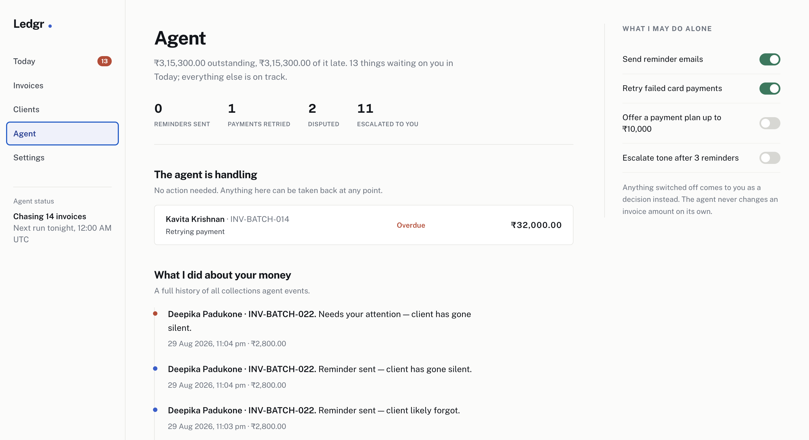
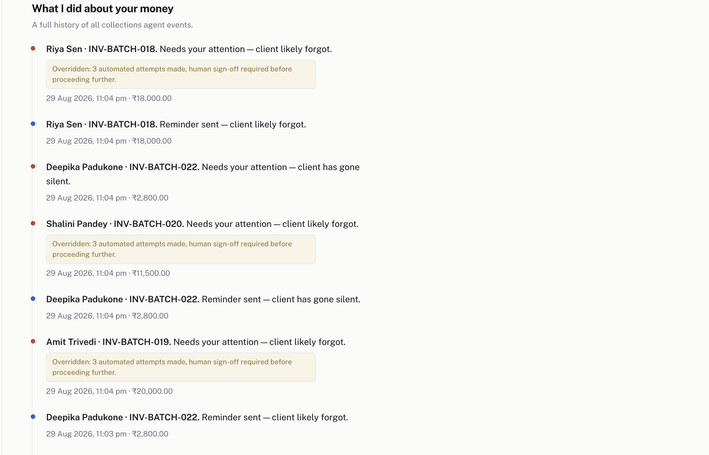
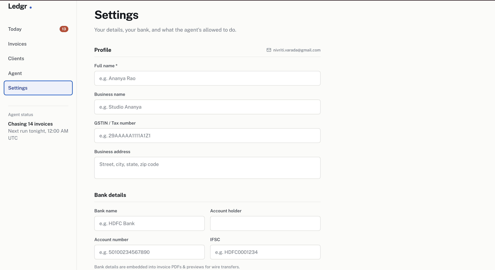
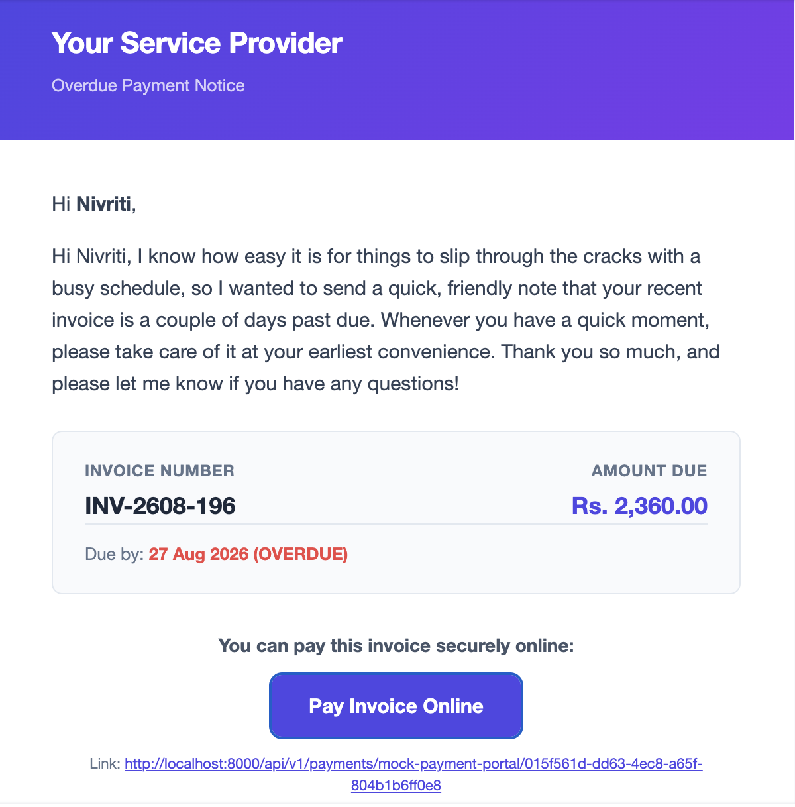
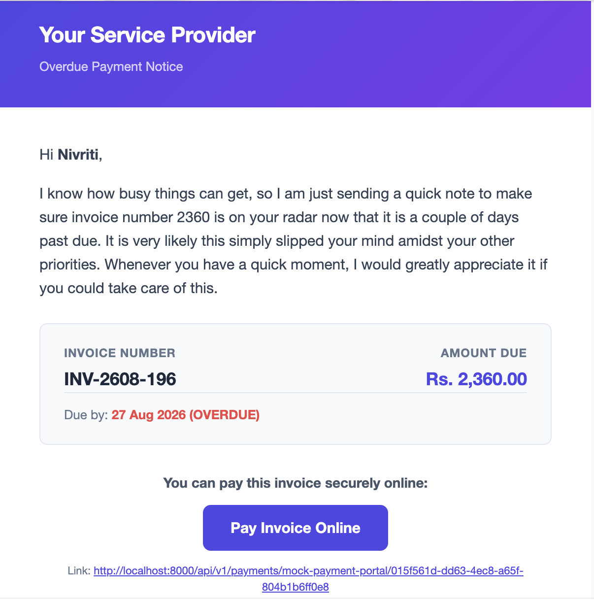

# Ledgr — AI Revenue Recovery Agent

Ledgr is a freelancer invoice tracker built into an AI agent that chases overdue B2B payments, so you don't have to. It classifies why an invoice is overdue, decides the right next step, and acts within hardcoded guardrails, logging every decision it makes along the way.

Built for Indian freelancers. Razorpay-powered, GST-aware.

## The problem

Revenue loss for freelancers rarely happens in one clean step. A payment fails, a client forgets, a client disputes the amount, or a client just goes silent. Chasing each of these manually, invoice by invoice, is repetitive and easy to fall behind on. Ledgr's agent takes over that chase while keeping a human in the loop for anything that actually needs judgement.

## What the agent does

For every overdue invoice, the agent runs a fixed pipeline:

1. **Classify** why payment hasn't happened: forgot, disputed, payment failed, or gone silent.
2. **Decide** the next action from a fixed list: send reminder, retry payment, escalate to human, mark disputed, or do nothing.
3. **Check guardrails** in plain code, not AI, before anything is sent.
4. **Act**: send an AI-drafted email, retry a failed payment, or stop and hand off to you.
5. **Log** the decision, so every action has a visible reason attached to it.

The agent decides what to say and when to nudge. It never decides when to stop contacting someone. Stopping rules, contact caps, and amount thresholds stay as plain, auditable code.

## Features
* **Escalation ladder**: gentle reminder → firmer follow-up → final notice → human handoff, based on days overdue.
* **Root-cause-aware intervention**: a failed payment gets a retry link, a dispute gets a human, silence gets a nudge.
* **Promise-to-pay tracking**: if a client commits to a date, escalation pauses until that date passes.
* **Guardrails**: contact caps, an amount threshold above which a human must approve, and a do-not-contact flag per client or invoice.
* **Audit trail**: every classification, decision, and override is logged with a timestamp and reason, visible in the dashboard, not buried in backend logs.

## Screenshots

### Sign in
The agent's status is visible from the moment you log in.



### Today
Your daily summary: what's outstanding, what's overdue, and what the agent is already handling.



### Needs you
The agent stops here on purpose. These are the invoices it won't touch without your sign-off, disputes, amounts over the threshold, and clients gone silent.



### Invoices
Every invoice, worst first, with its current status and what the agent last did about it.



### Clients
A running record of who pays, how much they've been billed, and their current status.



### Agent controls
Toggle what the agent may do on its own. Anything switched off comes back to you as a manual decision instead.



### Decision log
A full, timestamped history of every action the agent has taken and every guardrail override, with the reason attached.



### Settings
Business and bank details used to generate invoice PDFs and payment links.



## Sample emails

The agent drafts reminder emails itself, adjusting tone as an invoice moves up the escalation ladder.

### Stage 1: Gentle reminder


### Stage 2: Firmer follow-up


### Stage 3: Final notice


## Tech stack
* **Backend**: FastAPI (Python)
* **Database**: PostgreSQL via SQLAlchemy
* **Payments**: Razorpay
* **AI**: Anthropic API
* **Frontend**: React (Vite) + Tailwind CSS

## Project status

| Phase | Outcome | Status |
| :--- | :--- | :--- |
| 0. Foundation | Standalone LLM call works | In progress |
| 1. Data layer | Tables for decisions, guardrails, promises | In progress |
| 2. Core reasoning | Classifier, decider, drafting prompts | In progress |
| 3. Guardrails & workflow | Contact caps, escalation ladder, promise tracking | In progress |
| 4. Integration | Agent pipeline replaces the static cron email | In progress |
| 5. Measurement | Synthetic batch, metrics, audit trail UI | Not started |

## Setup

```bash
# Clone the repo
git clone <your-repo-url>
cd ledgr

# Backend
cd backend
pip install -r requirements.txt
# add your Anthropic API key and database URL to .env
uvicorn app.main:app --reload

# Frontend
cd frontend
npm install
npm run dev
```
